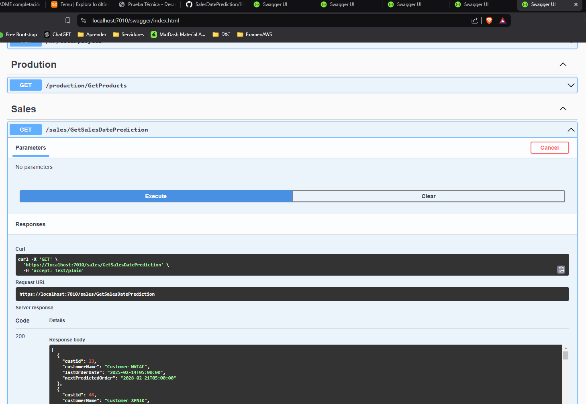
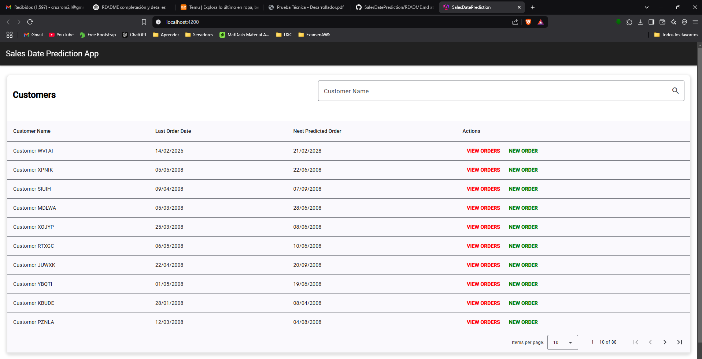
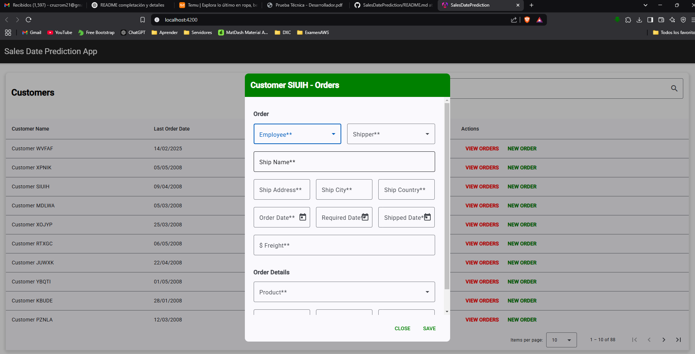
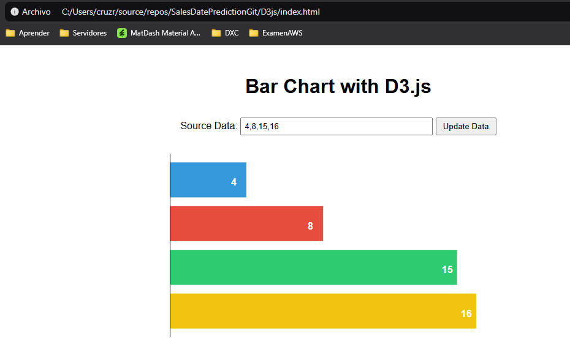

# Sales Date Prediction

Una plataforma web API que tiene como objetivo crear órdenes y predecir cuándo ocurrirá la próxima orden por cliente de acuerdo con los registros almacenados en la base de datos.

## Tabla de Contenidos

- [Descripción](#descripción)
- [Requisitos Previos](#requisitos-previos)
- [Instalación](#instalación)
  - [Clonar el Repositorio](#clonar-el-repositorio)
  - [Base de Datos](#base-de-datos)
  - [Backend](#backend)
  - [Frontend Angular](#frontend-angular)
  - [Frontend Vanilla JS](#frontend-vanilla-js)
- [Ejecución de la Prueba](#ejecución-de-la-prueba)
- [Información Adicional](#información-adicional)

---

## Descripción

Este proyecto está desarrollado en .NET 8.0 utilizando una arquitectura de microservicios. Se han creado tres servicios independientes:

1. **HR**: Gestiona la información de los empleados.
2. **Production**: Gestiona la información de los productos.
3. **Sales**: Administra las órdenes y la predicción de las órdenes.

Además, se implementó un **API Gateway** para facilitar la comunicación entre los servicios.

El proyecto incluye dos frontends:  
- **Angular**: Interactúa con los microservicios para la gestión de órdenes.  
- **Vanilla JS**: Proyecto simple utilizando D3.js para visualizaciones.  


---

## Requisitos Previos

- [.NET SDK](https://dotnet.microsoft.com/download) (versión recomendada: 8.0 o superior)
- [Node.js](https://nodejs.org/) (para ejecutar el proyecto en Angular)
- [Angular CLI](https://angular.dev/) (versión recomendada: 19.x o superior)
- [SQL Server](https://www.microsoft.com/sql-server) (para la base de datos)

---

## Instalación

### Clonar el Repositorio

Clona el repositorio del proyecto:

```bash
git clone https://github.com/cruzrom21/SalesDatePrediction.git
```

---

### Base de Datos

Los scripts de base de datos están diseñados para **SQL Server** y se encuentran en la carpeta `DMLs SqlSever`.  

- Incluyen la creación de **procedimientos almacenados** y **vistas**.  
- **Solo las vistas** son necesarias para que funcione el API en .NET.  
- **No hay un orden específico** para la ejecución de los scripts.  

Para ejecutar las vistas:  

1. Abre SQL Server Management Studio.  
2. Conéctate a tu instancia de SQL Server.  
3. Ejecuta los scripts de vistas en la base de datos correspondiente.  

---

### Backend

Se recomienda abrir el proyecto en Visual Studio.  

1. Navegar a la carpeta raíz, donde se encuentra el archivo `SalesDatePrediction.sln`:

    ```bash
    cd ./carpeta_raiz
    ```

2. Restaura las dependencias del proyecto:
    ```bash
    dotnet restore
    ```

   O en Visual Studio, clic derecho en la solución y selecciona "Restaurar paquetes de NuGet".

3. Configura la ruta de la base de datos para **cada microservicio**:  

    Los microservicios se encuentran en la ruta:  

    ```
    Backend/SalesDatePrediction/src/Services
    ```

    Cada microservicio tiene su propia carpeta con su nombre correspondiente.  

    - Abre el archivo `appsettings.json` de cada microservicio.
    - Busca la sección `ConnectionStrings`.
    - Cambia la ruta de la base de datos según tu configuración.  

    Ejemplo:

    ```json
    {
      "ConnectionStrings": {
        "Connection": "Server=your_server_name;Database=your_database_name;Trusted_Connection=True;TrustServerCertificate=True"
      }
    }
    ```

4. Configura las rutas en el **API Gateway**:  

    Dirígete al archivo `appsettings.json` en la ruta:

    ```
    Backend/SalesDatePrediction/src/Gateway/Api.Gateway.WebClient
    ```

    Configura las rutas de cada servicio de esta forma:

    ```json
    "ApiUrls": {
      "HRUrl": "https://localhost:44316/",
      "ProductionUrl": "https://localhost:44396/",
      "SalesUrl": "https://localhost:44361/"
    }
    ```

5. Ejecuta el proyecto, se debe configurar la ejecucion de todos los proyectos api de cada microservicio y el gateway todos al tiempo para su conrrecto funcionamiento.
   
---

### Frontend Angular

El proyecto Angular se encuentra en la carpeta:  

```
Frontend/SalesDatePrediction
```

1. Navega a la carpeta del proyecto Angular:

    ```bash
    cd Frontend/SalesDatePrediction
    ```

2. Instala las dependencias utilizando npm:

    ```bash
    npm install
    ```

3. Configura la URL del **API Gateway**:  

    - Abre el archivo:

      ```
      Frontend/SalesDatePrediction/src/app/services/orders.service.ts
      ```

    - Cambia la variable `apiUrl` por la URL del **API Gateway** generada al instalar el servicio backend.

4. Ejecuta el proyecto Angular:

    ```bash
    ng serve
    ```

5. Abre el navegador en:

    ```
    http://localhost:4200
    ```

---

### Frontend Vanilla JS

El proyecto en Vanilla JS se encuentra en la carpeta:  

```
D3js
```

- No requiere instalación.  
- Solo abre el archivo `index.html` en tu navegador.  
- No tiene dependencias externas.  

---

## Ejecución de la Prueba

Para probar la funcionalidad de predicción de órdenes:  

1. **Pruebas Unitarias**:  
   Se han implementado pruebas unitarias utilizando **XUnit**.  
   
   - Se pueden ejecutar desde Visual Studio o usando el comando:

        ```bash
        dotnet test
        ```

2. **Pruebas de API**:  
   Utiliza **Swagger** para probar los endpoints de los microservicios.  

   - Accede a las URLs de Swagger desde el navegador:

     ```
     http://localhost:puerto/swagger/index.html
     ```

3. **Pruebas desde el Frontend Angular**:  
   También se pueden probar las acciones de los microservicios desde el **frontend en Angular**.  
   - Este se conecta al API Gateway para realizar las peticiones.  

---

## Información Adicional

- Se optó por **vistas** en lugar de procedimientos almacenados en el backend para realizar los test con **XUnit** de manera más completa.  
- Los **procedimientos almacenados** incluidos en los scripts de base de datos son para demostrar el conocimiento en **sentencias DML**.  
- No fueron usados en el API ya que la ejecución de procedimientos almacenados **no es compatible con las pruebas unitarias** con InMemory.  
- El frontend en Angular interactúa con el **API Gateway** para gestionar las órdenes.  
- El frontend en Vanilla JS utiliza **D3.js** para visualizaciones simples y no requiere configuración adicional.  

---

## Resultados de las Pruebas

Aquí se muestran algunas imágenes que demuestran las pruebas realizadas.

### Prueba de Ejecución del API


### Prueba de Interacción en Angular
.


### Prueba de Visualización en Vanilla JS


